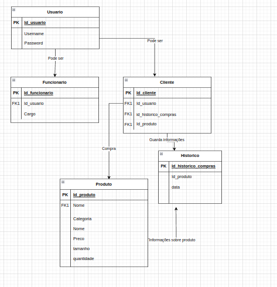

# tendTUDO
- É uma rede de lojas com 3 unidades pelo rio de janeiro. 
## Site
- O site requerido foi um site para vendas buscando aumentar as vendas da sua rede de lojas. 
## Proposito
- O site deve comportar 2 tipos de usuarios. (Clientes ou funcionarios)

## Cliente:
O cliente realiza um compra de um determinado produto. 
## Funcionario: 
O funcionario pode alterar alguns dados do produto ou inserir um novo produto. 

## Conceito 
- Foi feita um modelagem simples para atender o fluxo de dados no site. 

## Implementação:
Até o momento foram feitas as funcionalidades:
 - Compra do produto.
 - Criação de usuario(Cliente).
 - CRUD completo do cliente.  

